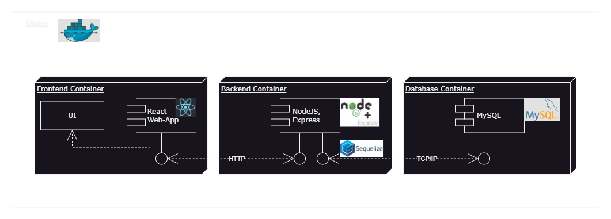

# Finance Tracker

---

## 1. Project Overview

The Finance Tracker is a web-based application for managing personal finances. Users can categorize, edit, and delete their expenses, as well as view statistics on their spending.
This project involves the development of a complete CRUD application running in Docker containers.

### Techniques, Frameworks, and Tools

- **Frontend:** React, JavaScript, CSS
- **Backend:** Node.js, Express, Sequelize
- **Database:** MySQL
- **Containerization:** Docker, Docker Compose, Docker Swarm
- **Orchestration:** Docker Swarm for managing multiple containers and load balancing
- **Security:** User permissions for containers, HTTPS for Docker REST API, vulnerability scanning with Trivy
- **Monitoring and Logging:** Monitoring containers and log management

---

## 2. Preview

### Home


### Add Transaction


### Edit Transaction


### Statistics


---

## 3. Component Diagram



### Communication Between Components

Communication between the various components of the application occurs over a network within the Docker environment.

- **Frontend (React):** The frontend sends HTTP requests to the backend to process user interactions such as adding, editing, and deleting transactions. These requests are made via an API implemented in the backend.
- **Backend (Node.js with Express and Sequelize):** The backend acts as an intermediary between the frontend and the MySQL database. It receives requests from the frontend, performs the required CRUD operations on the MySQL database, and sends the results back to the frontend. The Sequelize library is used to manage interactions with the database, including model creation and query execution.
- **Database (MySQL):** MySQL stores all data related to financial transactions. The backend connects to the MySQL database using connection parameters defined in the Docker environment variables (such as host, username, password).
- **Docker:** Docker orchestrates the entire infrastructure. It ensures that all components (frontend, backend, and MySQL) run in isolated containers and communicate with each other over a defined network (docker-compose networks). Docker Swarm also enables service scaling and load balancing.

---

## 4. Docker Features

**Start and view containers:**

```bash
$ docker-compose up -d --build
$ docker images
```

**Stop containers:**

```bash
$ docker-compose down
```

**View running containers:**

```bash
$ docker ps
```

**View tags and versioning:**

```bash
$ docker images
```

**Inspect volumes:**

```bash
$ docker inspect finance_tracker_db
```

**Remove volumes:**

```bash
$ docker volume ls
$ docker-compose down
$ docker volume rm finance-tracker_db_data
$ docker volume ls
```

**Monitor resources:**

```bash
$ docker stats
```

**Logging:**

```bash
$ docker logs finance_tracker_backend
$ docker logs -f finance_tracker_backend
```

**Vulnerability scanning:**

```bash
$ trivy image finance-tracker-backend:v1.0
$ trivy image finance-tracker-frontend:v1.0
```

**Scaling:**

```bash
$ docker-compose down
$ docker-compose up -d --scale backend=3 --scale frontend=2
```

**Load Balancing:**

```bash
$ docker swarm init
$ docker stack rm finance-tracker
$ docker network rm finance-tracker_finance_network

$ docker-compose build

$ docker stack deploy -c docker-compose-swarm.yml finance-tracker

$ docker service ls
$ docker service ps finance-tracker_backend
$ docker service ps finance-tracker_frontend

$ docker stack rm finance-tracker
$ docker service ls
$ docker swarm leave --force
$ docker network ls
$ docker network rm finance-tracker_finance_network
```

**Docker REST API with HTTP**

```bash
$ curl http://localhost:2375/version
$ curl http://localhost:2375/containers/json
$ curl http://localhost:2375/images/json
```

---
