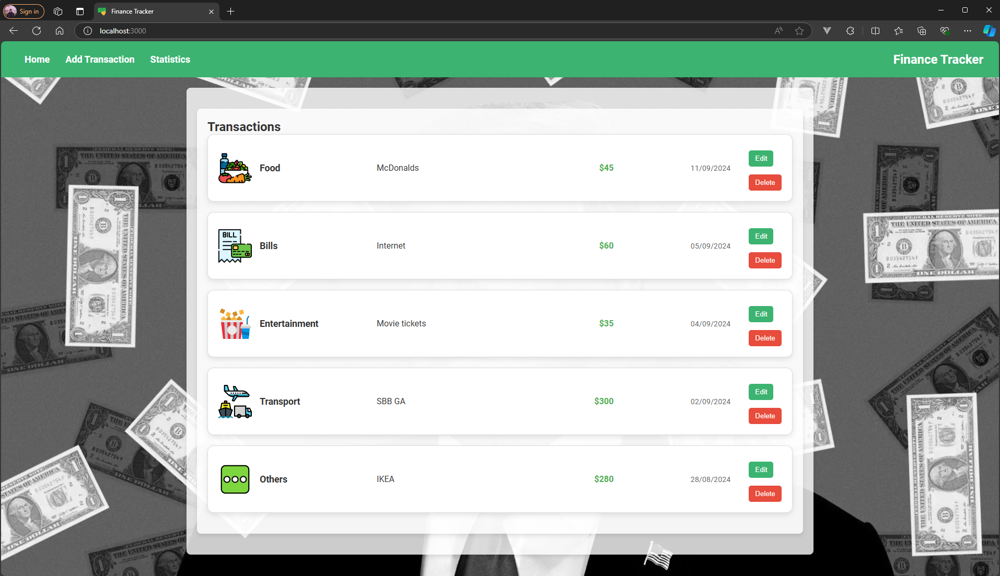
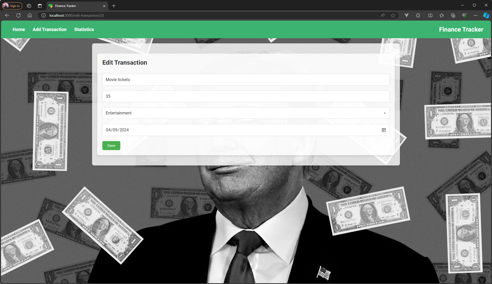
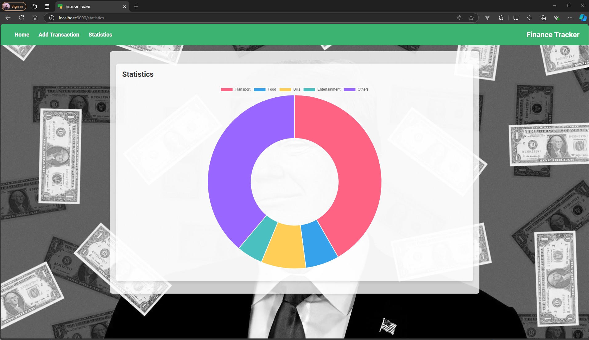

# Finance Tracker

## 1. Projektauftrag

### Ziel

Der Finance Tracker ist eine webbasierte Anwendung zur Verwaltung persönlicher Finanzen. Benutzer können ihre Ausgaben kategorisieren, bearbeiten und löschen sowie Statistiken zu ihren Ausgaben anzeigen lassen. Das Ziel des Projekts ist es, eine benutzerfreundliche und interaktive Webanwendung zu entwickeln, die Finanztransaktionen effizient verwaltet und visualisiert.

### Projektbeschreibung

Dieses Projekt umfasst die Entwicklung einer vollständigen CRUD-Anwendung, die in Docker-Containern läuft. Die Anwendung bietet Funktionen zum Hinzufügen, Bearbeiten, Löschen und Anzeigen von Finanztransaktionen. Sie wurde mit React für das Frontend und Node.js (mit Express und Sequelize) für das Backend entwickelt. Die Anwendung wird in einer Containerumgebung bereitgestellt, die mithilfe von Docker Compose und Docker Swarm orchestriert wird, um Skalierbarkeit und Belastbarkeit zu gewährleisten.

### Erwartete Schwierigkeiten

- Dateninkonsistenzen zwischen Frontend und Backend managen.
- Sicherstellung der Datenintegrität bei gleichzeitigen Zugriffen auf die Datenbank.
- Implementierung von HTTPS für die Docker REST API zur Sicherung der Kommunikation.
- Bewältigung von Herausforderungen bei der Containerorchestrierung, wie Netzwerkmanagement und Ressourcenbeschränkungen.
- Durchführung von Sicherheitsmaßnahmen und Schwachstellenüberprüfungen.

### Techniken, Frameworks und Tools

- **Frontend:** React, JavaScript, CSS
- **Backend:** Node.js, Express, Sequelize
- **Datenbank:** MySQL
- **Containerisierung:** Docker, Docker Compose, Docker Swarm
- **Orchestrierung:** Docker Swarm für die Verwaltung mehrerer Container und Load Balancing
- **Sicherheit:** Benutzerrechte für Container, HTTPS für Docker REST API, Schwachstellenprüfung mit Trivy
- **Monitoring und Logging:** Überwachung von Containern und Log-Management

## 2. Komponentendiagramm

TODO

### Kommunikation zwischen den Komponenten

Die Kommunikation zwischen den verschiedenen Komponenten der Anwendung erfolgt über ein Netzwerk innerhalb der Docker-Umgebung.

- **Frontend (React):** Das Frontend sendet HTTP-Anfragen an das Backend, um Benutzerinteraktionen wie das Hinzufügen, Bearbeiten und Löschen von Transaktionen zu verarbeiten. Diese Anfragen erfolgen über eine API, die im Backend implementiert ist.
- **Backend (Node.js mit Express und Sequelize):** Das Backend fungiert als Vermittler zwischen dem Frontend und der MySQL-Datenbank. Es empfängt Anfragen vom Frontend, führt die erforderlichen CRUD-Operationen auf der MySQL-Datenbank durch und sendet die Ergebnisse zurück an das Frontend. Die Sequelize-Bibliothek wird verwendet, um die Interaktionen mit der Datenbank zu verwalten, einschließlich der Erstellung von Modellen und der Durchführung von Abfragen.
- **Datenbank (MySQL):** MySQL speichert alle Daten zu den Finanztransaktionen. Das Backend verbindet sich über die in den Docker-Umgebungsvariablen definierten Verbindungsparameter (wie Host, Benutzername, Passwort) mit der MySQL-Datenbank.
- **Docker:** Docker orchestriert die gesamte Infrastruktur. Es stellt sicher, dass alle Komponenten (Frontend, Backend und MySQL) in isolierten Containern laufen und über ein definiertes Netzwerk (docker-compose Netzwerke) miteinander kommunizieren können. Docker Swarm ermöglicht darüber hinaus die Skalierung der Services und sorgt für Load Balancing.

## 3. Docker Features

**Container aufstarten und anschauen:**

```bash
$ docker-compose up -d --build
$ docker images
```

**Container stoppen:**

```bash
$ docker-compose down
```

**Laufende Containers anzeigen:**

```bash
$ docker ps
```

**Tags und Versionierung anschauen:**

```bash
$ docker images
```

**Inspect volumes:**

```bash
$ docker inspect finance_tracker_db
```

**Remove volumes:**

```bash
$ docker volume ls
$ docker-compose down
$ docker volume rm finance-tracker_db_data
$ docker volume ls
```

**Ressourcen monitoren:**

```bash
$ docker stats
```

**Logging:**

```bash
$ docker logs finance_tracker_backend
$ docker logs -f finance_tracker_backend
```

**Vulnerability scanning:**

```bash
$ trivy image finance-tracker-backend:v1.0
$ trivy image finance-tracker-frontend:v1.0
```

**Skalierung:**

```bash
$ docker-compose down
$ docker-compose up -d --scale backend=3 --scale frontend=2
```

**Load Balancing:**

```bash
$ docker swarm init
$ docker stack rm finance-tracker
$ docker network rm finance-tracker_finance_network

$ docker-compose build

$ docker stack deploy -c docker-stack.yml finance-tracker

$ docker service ls
$ docker service ps finance-tracker_backend
$ docker service ps finance-tracker_frontend

$ docker stack rm finance-tracker
$ docker service ls
$ docker swarm leave --force
$ docker network ls
$ docker network rm finance-tracker_finance_network
```

## 4. Demo

### Home Seite



### Add Transaction


### Edit Transaction



### Statistics


